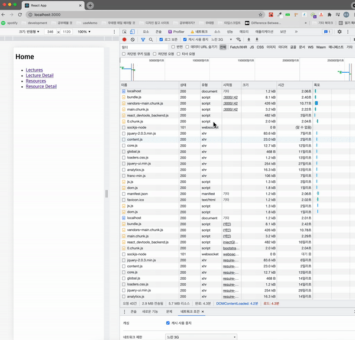

# React.lazy 를 사용한 페이지 별 Code Splitting

## Route-based Code Splitting

> 페이지 별로 lazy 를 사용하면 코드 분할이 되는 것을 확인할 수 있다.

```js
// import Home from "./pages/Home";
// import LectureDetail from "./pages/LectureDetail";
// import Lectures from "./pages/Lectures";
// import ResourceDetail from "./pages/ResourceDetail";
// import Resources from "./pages/Resources";

const Home = lazy(() => import("./pages/Home"));
const LectureDetail = lazy(() => import("./pages/LectureDetail"));
const Lectures = lazy(() => import("./pages/Lectures"));
const ResourceDetail = lazy(() => import("./pages/ResourceDetail"));
const Resources = lazy(() => import("./pages/Resources"));

const App = () => {
  return (
    <Router>
      <ErrorBoundary>
        <Suspense fallback={<h1>Loading...</h1>}>
          <Switch>
            <Route path="/" exact component={Home} />
            <Route path="/lecture-detail" component={LectureDetail} />
            <Route path="/lectures" component={Lectures} />
            <Route path="/resource-detail" component={ResourceDetail} />
            <Route path="/resources" component={Resources} />
          </Switch>
        </Suspense>
      </ErrorBoundary>
    </Router>
  );
};
```

---

|일반 Bundling|Route-based Code Splitting|
|---|---|
|||
|||


---

## Suspense 와 ErrorBoundary
> Chrome 개발자 도구의 네트워크 탭에서 느린 3G, 오프라인 설정으로 Suspense, ErrorBoundary를 사용해보자

|
