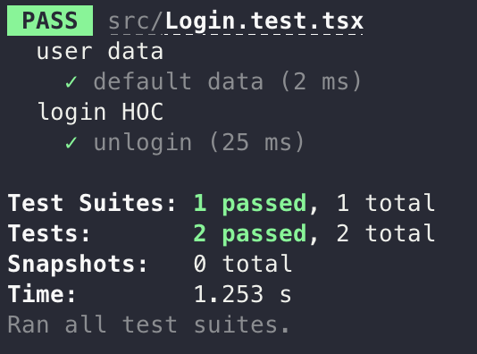
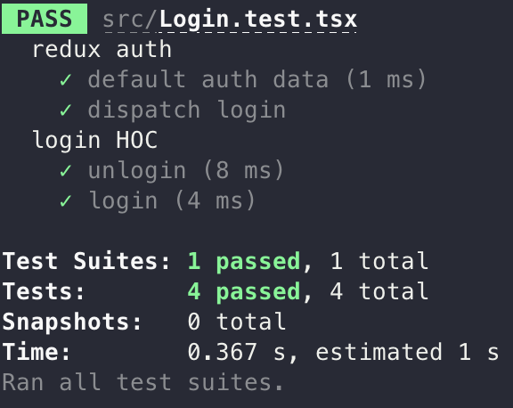

# [React] 고차 컴포넌트 (Higher Order Component)

고차 컴포넌트는 React의 구조적 특성에서 나오는 패턴으로, **컴포넌트 로직을 재사용**하기 위한 React의 고급 기술입니다.

일반적인 컴포넌트는 부모로부터 받은 props를 UI에 반영하는 반면, 고차 컴포넌트는 **컴포넌트**를 전달받아 새로운 컴포넌트로 변환합니다.

컴포넌트는 React에서 코드 재사용의 기본 단위 입니다. 하지만, 어떤 패턴에 대해서는 일반적인 컴포넌트 만으로 코드의 중복을 줄일 수 없습니다.

**고차 컴포넌트**는 컴포넌트를 입력받아 어떤 기능을 수행 후 컴포넌트를 반환합니다.
반복적인 로직을 고차 컴포넌트를 이용해 추상화하면 **공통기능을 분리**할 수 있습니다.
<br>

## 고차 함수

고차함수는 고차 함수 내에서 필요로 하는 기능을 수행한 뒤, 인자로 받은 함수를 필요한 시점에 호출합니다.
이는 자바스크립트에서 함수가 **일급 객체**이기 때문에 가능한 내용입니다.

- 일급 객체
  - 변수에 할당(assignment)할 수 있다.
  - 다른 함수의 인자(argument)로 전달될 수 있다.
  - 다른 함수의 결과로서 return될 수 있다.

<br>

---

<br>

## 일단 부딪쳐보며 고차 컴포넌트 작성

위에도 언급했듯이 일반적인 컴포넌트로 줄일 수 없는 공통적인 요소를 줄이기 위해서 고차 컴포넌트를 사용하는데, 프론트엔드 개발에서 공통적인 부분이 어느 부분인지 고민해 볼 필요가 있었다..

이제까지 몇 가지 프로젝트를 진행했을 때, 개인적인 경험으로는 상태 관리 라이브러리를 이용해 컴포넌트 개발을 진행할 때, **로그인 상태**에 따라서 다른 UI를 보여주거나, **data fetching**을 해서 UI를 보여줘야 하는 경우가 있을 것 같다고 생각했습니다.

그래서 일단 간단하게 **redux**를 이용하여 **TDD** 방식으로 일단 부딪쳐보며 개발을 해보았습니다.

<br>

먼저, **redux toolkit** 의 `createSlice` 를 이용해서 간단한 reducer를 만들었습니다. 고차 컴포넌트에 집중하기 위해 해당 내용은 생략하겠습니다.

- 테스트 코드 작성

  ```tsx
  import { render, screen } from "./test-utils";
  import { AnyAction } from "redux";
  import MyPage from "./MyPage";

  import authReducer from "./store/auth";

  describe("user data", () => {
    it("default data", () => {
      expect(authReducer(undefined, {} as AnyAction)).toEqual({ user: null });
    });
  });

  describe("login HOC", () => {
    it("unlogin", () => {
      render(<MyPage />);
      const elem = screen.getByText(/please login/i);
      expect(elem).toBeInTheDocument();
    });
  });
  ```

- 테스트 성공을 위한 코드 작성

  ```tsx
  import { useSelector } from "react-redux";
  import { UserState } from "./store/auth";
  import { RootState } from "./store";
  
  function MyPage() {
    const { user } = useSelector<RootState, UserState>((state) => state.auth);
    if (!user) {
      return <p>please login</p>;
    }
  
    return <p>login done</p>;
  }
  
  export default MyPage;
  ```

<br>



<br>

무사히 성공했습니다 ! 그러나 저희가 원하는 것은 이러한 내용이 아닙니다. 좀 더 컴포넌트가 하는 일을 명확히 하고, **공통적인 요소**를 고차 컴포넌트를 이용해 제거하고자 합니다. 그래서 **withAuth**라는 HOC를 만들어보고자 합니다. 먼저 테스트 코드를 수정하겠습니다 ! 

<br>

- 테스트 코드 수정

  ```tsx
  import { render, screen, testStore } from "./test-utils";
  import withLogin from "./withLogin";
  import { AnyAction } from "redux";
  import MyPage from "./MyPage";
  
  import authReducer, { login } from "./store/auth";
  
  describe("redux auth", () => {
    it("default auth data", () => {
      expect(authReducer(undefined, {} as AnyAction)).toEqual({ user: null });
    });
    it("dispatch login", () => {
      expect(authReducer(undefined, login("jiyong"))).toEqual({
        user: { name: "jiyong" },
      });
    });
  });
  
  describe("login HOC", () => {
    const PageWithAuth = withLogin(MyPage);
    it("unlogin", () => {
      render(<PageWithAuth />);
      expect(screen.getByText(/please login/i)).toBeInTheDocument();
    });
    it("login", () => {
      render(<PageWithAuth />);
      testStore.dispatch(login("jiyong"));
      expect(screen.getByText(/jiyong/i)).toBeInTheDocument();
    });
  });
  ```

  - 위의 테스트는 올바르게 **reducer**가 작동하는지 확인하기 위한 테스트
  - 아래의 테스트는 로그인 상황에 따른 **HOC** 테스트

<br>

먼저 위에 사용되었던 `MyPage` 컴포넌트를 로그인이 되어있든 안되어있든 관심없고, 그냥 전달해주는데로 렌더링 해주는 역할로 변경시키겠습니다. 그리고 **withLogin** 고차 컴포넌트를 작성하여 로그인의 상황에 따라 렌더링해줄 수 있도록 코드를 작성해보겠습니다.

- MyPage 컴포넌트 수정

  ```tsx
  interface Props {
    user: { name: string };
  }
  
  function MyPage({ user }: Props) {
    return <p>hi! {user.name}</p>;
  }
  
  export default MyPage;
  ```

- **withLogin** 작성

  ```tsx
  import { ComponentType } from "react";
  import { useSelector } from "react-redux";
  import { UserState } from "./store/auth";
  import { RootState } from "./store";
  
  function withLogin<P>(ChildComponent: ComponentType<P>) {
    return function Wrapper(props: Omit<P, "user">) {
      const { user } = useSelector<RootState, UserState>((state) => state.auth);
      if (user) {
        return <ChildComponent user={user} {...(props as P)} />;
      } else {
        return <p>please login</p>;
      }
    };
  }
  
  export default withLogin;
  ```

<br>



<br>

성공했습니다 😙

이제 위의 withLogin 고차 컴포넌트를 사용한다면, 권한이 필요한 상황에 대해서 로그인의 여부를 굳이 가져올 필요 없이 (코드의 중복을 줄이고) 렌더링 할 UI에 대해 집중할 수 있을 것 같습니다 !

이렇게 간단한 예제 이외에도 데이터 fetching의 상황에 따라 로딩 컴포넌트를 보여줄 것인지, 아니면 데이터를 props로 전달하여 원하는 컴포넌트를 렌더링할 것인지 등..., 여러가지 상황에서 쓰일 수 있을 것 같습니다.

이러한 내용들을 학습하면서 드는 생각이지만 개발자로서 무언가 구현을 위해 노력하는 것은 당연하지만, 그러면서도 **함수 혹은 모듈의 역할을 명확히 하여 유지/보수 측면에서 좋은 코드를 작성하기 위해 고민하는 것도 중요하다**라는 것을 다시 한번 느낄 수 있었습니다..! 🤯

