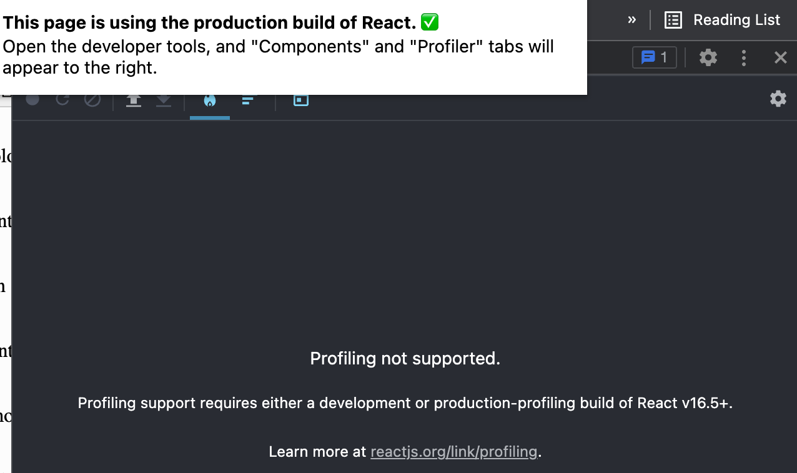
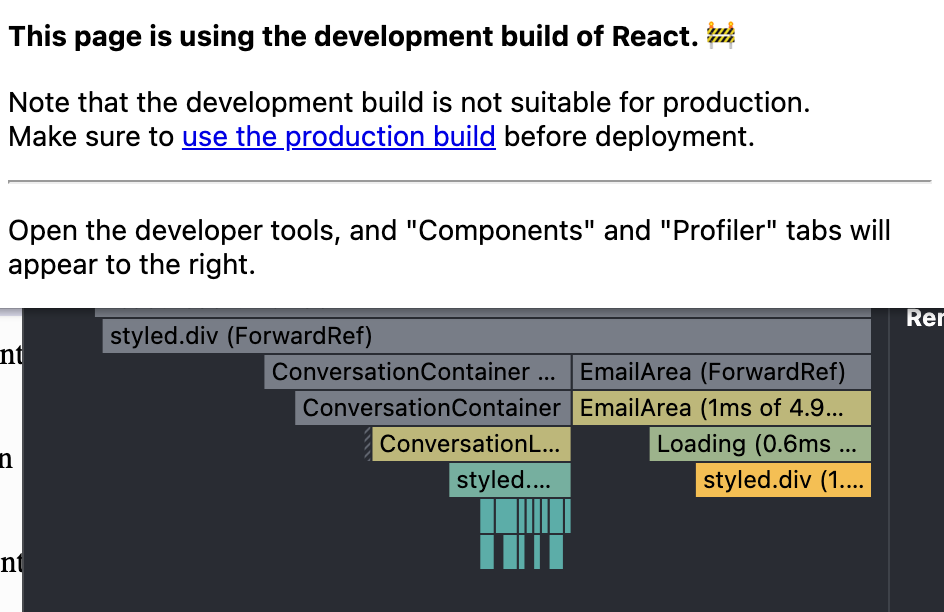
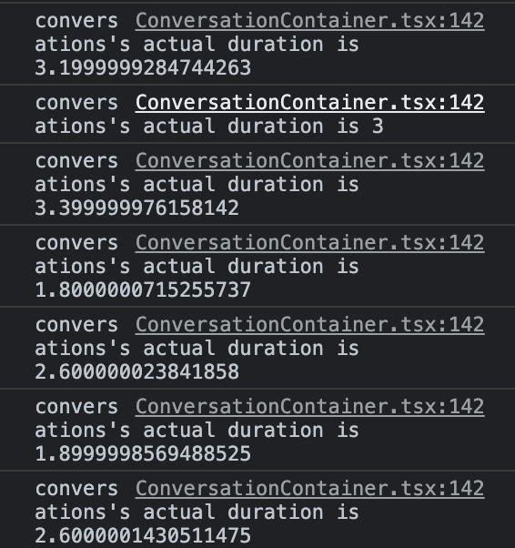
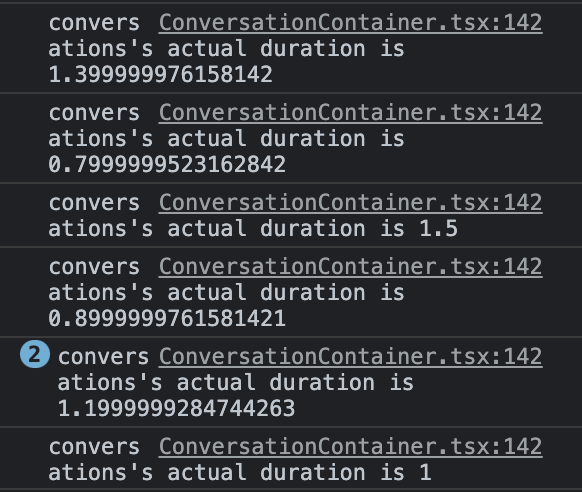

# [react] Profiler API

`Profiler`는 React App이 렌더링하는 빈도와 렌더링 비용을 측정합니다.

주의할 점은 `Profiler` 가 오버헤드를 만들기 때문에 **프로덕션 빌드에서는 비활성화되어 있다는 점 입니다.** 실제로 제가 구현한 App을 production과 development 환경으로 실행시켜 Profiler를 실행시켜 보았습니다.

- production

  

- development

  

주로 사용하는 번들러인 `Webpack`을 사용한다면 **4 버전 이상일 경우 production mode에서 profiler를 지원하지 않는 등의 방법으로 코드를 최소화** 시켜주지만 그 이하의 버전일 경우 **TenserPlugin**을 사용해주어야 합니다.

<br>

## 사용법

`Profiler`는 React 트리 내에 어디에나 추가될 수 있습니다. Profiler를 추가하면 특정 부분의 렌더링 비용을 계산해줍니다. 이때 필요한 **props**는 두 가지 입니다.

**id**와 **onRender** 콜백 함수이며 Profiler 컴포넌트 하위의 컴포넌트에 업데이트가 커밋되면 호출됩니다.

```jsx
import { Profiler } from 'react';

render (
  <App>
  	<Profiler id="Navigation" onRender={callback}>
    	<Navigation />
    </Profiler>
  </App>
)
```

위처럼 사용할 수 있으며 복수의 `Profiler` 컴포넌트를 사용하여 다른 부분들을 계산할 수 있습니다.

`Profiler` 컴포넌트는 가벼운 컴포넌트 이지만, 조금의 CPU와 메모리를 잡아먹기 때문에, 필요할 때만 사용해야 합니다.

<br>

---

<br>

## onRender

위에도 언급한 바와 같이 **onRender**로 콜백 함수를 전달해야 합니다. 콜백 함수는 다음과 같습니다.

```javascript
function onRenderCallback(
	id,
  phase,
  actualDuration,
  baseDuration,
  startTime,
  commitTime,
  interactions
) {
  // 기능..
}
```

- 각 인자들은 다음과 같습니다.
  - **id** : 방금 커밋된 `Profiler` 컴포넌트의 **id** prop, 위에도 언급한 바와 같이 복수의 `Profiler` 컴포넌트를 사용할 수 있는데, 이 때 복수의 컴포넌트를 사용할 시 어떤 컴포넌트가 해당 콜백을 실행시켰는지에 대해 알 수 있습니다.
  - **phase** : 해당 컴포넌트가 마운트된건지, 아니면 어떤 이벤트 혹은 상태 변화로 인하여 리렌더링 된건지를 식별합니다. (**mount**, **update**)
  - **actualDuration** : 현재 업데이트에 해당하는 자손 컴포넌트들을 렌더하는데 걸린 시간, 이는 하위 트리가 얼마나 **메모이제이션**을 잘 활용하고 있는지를 암시합니다. 이상적으로 다수의 컴포넌트들은 특정 prop이 변할 경우에만 리렌더링이 필요하기 때문에 이 값은 초기 렌더링 이후 상당 부분 감소해야 합니다.
  - **baseDuration** : `Profiler` 트리 내 개별 컴포넌트들의 렌더링 비용의 최악 케이스를 계산해줍니다.
  - **startTime** : react가 현재 업데이트에 대해 렌더링을 시작한 시간
  - **commitTime** : react가 현재 업데이트를 커밋한 시간
  - **interactions** : 업데이트가 계획되었을 때 추적하고 있던 상호작용의 집합

<br>

---

<br>

## 일단 부딪쳐보며 사용해보기

제가 구현한 App에 대해서 한 번 사용해보도록 하겠습니다. App의 코드를 전부 공유해드릴 수 없는 점 양해 부탁드립니다..ㅠㅠ 😅

<br>

- **onRender** 콜백 함수 작성

  ```javascript
  const renderCallback: ProfilerOnRenderCallback = (
    id,
    phase,
    ad,
    bd,
    st,
    ct,
    interations
  ) => {
    console.log(`${id}'s actual duration is ${ad}`);
  };
  ```

  - 단순하게 현재 업데이트 된 컴포넌트가 얼마나 최적화가 잘 되어있는지 확인하기 위해서 다음과 같은 함수를 작성하였습니다.

<br>

단순하게 props에 따라 결과가 달라지는 컴포넌트에 **memo**를 사용하지 않아보고, 사용해 보면서 그 결과를 한번 비교해보겠습니다.

- **memo**를 사용하지 않은 컴포넌트에서의 결과

  

- **memo**를 사용하여 최적화한 컴포넌트에서의 결과

  

<br>

이처럼 `Profiler`를 이용하여 본인이 작성한 컴포넌트의 최적화가 잘 되어가는지를 확인할 수 있습니다!

<br>

이전에는 매번 '이렇게 하면 최적화가 되겠지..?' 라고 생각만 했었는데, 이제는 React App을 만들 때 `Profiler`를 사용하여 최적화에 대해 직접적으로 확인할 수 있을 것 같네요..

긴 글 읽어주셔서 감사합니다 !! 🥺


