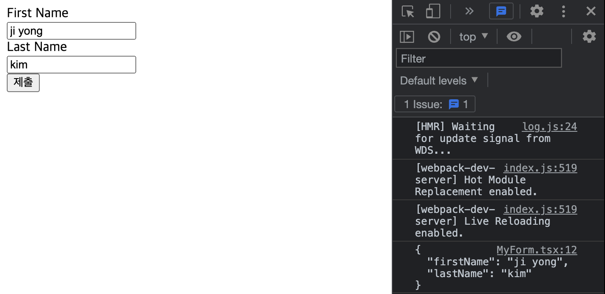

# 비제어 컴포넌트

[공식문서](https://ko.reactjs.org/docs/uncontrolled-components.html)를 참고하여 글을 작성하였습니다.

<br>

**제어 컴포넌트**에서 폼 데이터는 React 컴포넌트에서 다루어 집니다. ( `setState` )

이의 대안인 비제어 컴포넌트는 DOM 자체에서 폼 데이터가 이루어집니다.

대부분의 경우에는 폼을 구현하는데에 **제어 컴포넌트**를 사용하는 것이 좋습니다.

<br>

**비제어 컴포넌트**를 만들려면 `ref` 를 사용하여 DOM에서 폼 값을 가져올 수 있습니다.

<br>

## 기본 값 (defaultValue)

비제어 컴포넌트를 사용하면 초기값을 지정할 수 있지만, 이후 업데이트는 제어하지 않는 것이 좋습니다. 이러한 경우 `value` 어트리뷰트 대신 `defaultValue` 를 지정할 수 있습니다. 컴포넌트가 마운트 된 이후에 defaultValue 어트리뷰트를 변경하더라도 DOM의 값이 업데이트 되지 않습니다.

또한 **type="checkbox"** 와 같은 input에 대해서는 `defaultChecked` 를 지원하고 있습니다.

<br>

---

<br>

## 파일 입력 태그

React 에서 `<input type="file"/>` 은 프로그래밍적으로 값을 설정할 수 없고 사용자만이 값을 설정할 수 있기 때문에 항상 **비제어 컴포넌트**입니다.

<br>

---

<br>

## FORMIK 라이브러리

프론트엔드 개발을 하다보면 폼을 이용하는 경우가 많습니다.

적은 수의 input만 다루게 된다면 `value`와 `onChange` 를 이용하여 제어하기 편할 수 있지만, 많은 input혹은 form을 다루게 된다면 모든 태그에 value와 onChange를 작성하는 것은 매우 귀찮은 작업이 될 수 있습니다.

이러한 작업을 깔끔하게 해주기 위해 **React Hook Form**, **Redux Form**, **Formik**등 여러가지 라이브러리가 존재합니다.

간단한 코드를 작성해 보았습니다.

```tsx
import { useFormik } from 'formik';
import styled from 'styled-components';

export default function MyForm() {
  const { values, handleSubmit, handleChange } = useFormik({
    initialValues: {
      firstName: '',
      lastName: '',
    },
    onSubmit: (values) => {
      console.log(JSON.stringify(values, null, 2));
    },
  });

  return (
    <Form onSubmit={handleSubmit}>
      <label htmlFor="firstName">First Name</label>
      <input type="text" name="firstName" id="firstName" value={values.firstName} onChange={handleChange} />
      <label htmlFor="lastName">Last Name</label>
      <input type="text" name="lastName" id="lastName" value={values.lastName} onChange={handleChange} />
      <button type="submit">제출</button>
    </Form>
  );
}
```

<br>

- 제출 결과



<br>

이외에도 validation을 위한 `validate` 를 추가할 수 있고, submit 시 `actions.resetForm` 을 이용하여 폼을 intialValue로 초기화 할 수도 있습니다.